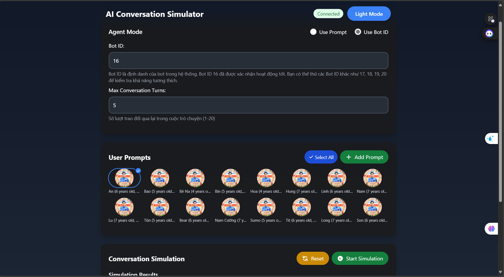
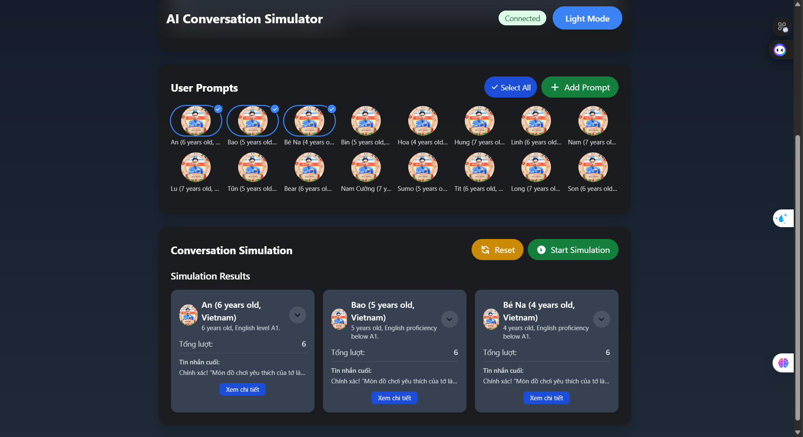
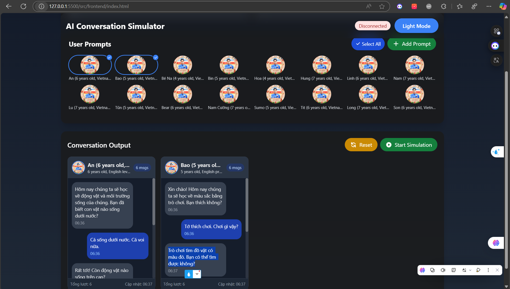
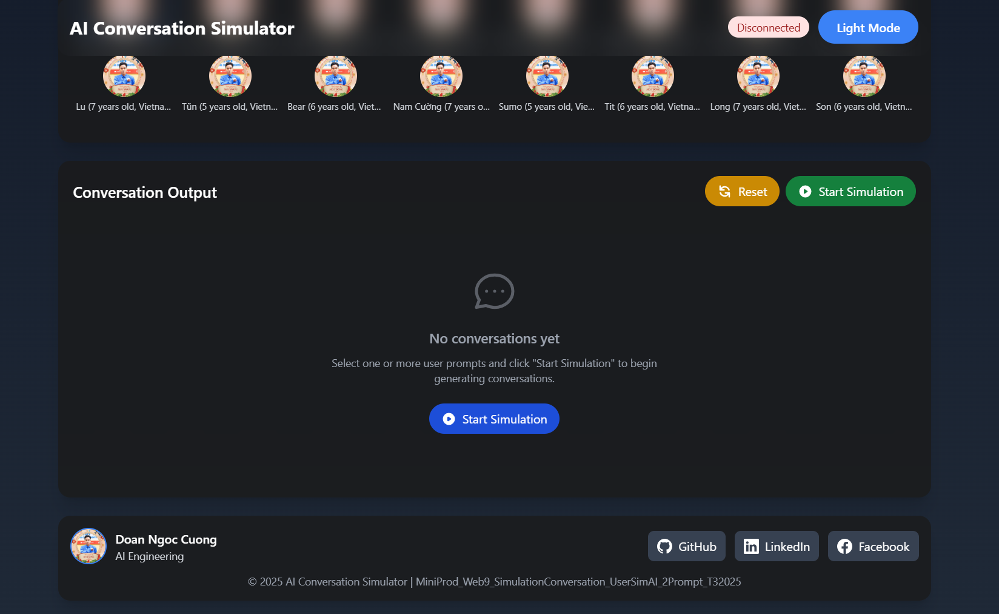

# WebSimulationConversation

Ứng dụng mô phỏng hội thoại giữa người dùng và bot AI, cho phép kiểm thử và đánh giá các tương tác trong môi trường giả lập.

## Tổng quan

WebSimulationConversation là một ứng dụng web cho phép mô phỏng các cuộc hội thoại giữa người dùng (được mô phỏng bởi AI) và bot AI. Ứng dụng này hữu ích cho việc kiểm thử, đánh giá và cải thiện trải nghiệm người dùng với các hệ thống trò chuyện AI.

- **Frontend**: React, TailwindCSS
- **Backend**: FastAPI, WebSockets
- **AI**: OpenAI API, API bên ngoài (Robot AI Lesson)
- **Deployment**: Docker

## Tính năng chính

- Mô phỏng hội thoại giữa người dùng và bot AI
- Hỗ trợ nhiều loại người dùng với các đặc điểm khác nhau (tuổi, trình độ, sở thích...)
- Tùy chỉnh prompt cho cả người dùng và bot
- Hiển thị kết quả mô phỏng trong thời gian thực
- Giao diện thân thiện với người dùng, hỗ trợ chế độ tối/sáng
- Khả năng mở rộng với nhiều bot ID khác nhau

## Cài đặt và chạy

### Yêu cầu

- Node.js (>= 14.0.0)
- Python (>= 3.8)
- Docker (tùy chọn)

### Cài đặt thủ công

1. Clone repository:
```bash
git clone https://github.com/DoanNgocCuong/WebSimulationConversation.git
cd WebSimulationConversation
```

2. Cài đặt dependencies cho backend:
```bash
cd src/backend
pip install -r requirements.txt
```

3. Chạy backend:
```bash
uvicorn main:app --host 0.0.0.0 --port 25050 --reload --log-level debug
```

4. Chạy frontend (trong terminal khác):
```bash
cd src/frontend
# Mở file index.html bằng trình duyệt hoặc sử dụng live-server
```

### Sử dụng Docker

1. Build và chạy container:
```bash
docker-compose up -d
```

2. Truy cập ứng dụng tại: http://localhost:25050

## Sử dụng

1. Chọn chế độ Agent (Bot ID hoặc Custom Prompt)
2. Chọn một hoặc nhiều User Prompt để mô phỏng
3. Nhấn "Start Simulation" để bắt đầu mô phỏng
4. Xem kết quả mô phỏng trong phần "Conversation Output"
5. Sử dụng nút "Reset" để bắt đầu lại mô phỏng mới

## Khó khăn lớn nhất

Một trong những thách thức lớn nhất là vấn đề kết nối API trong môi trường Docker:

```git
commit 9a04f3e8f2d5c7b1a0d3f4e5d6c7b8a9
Author: Cuong Doan <doanngoccuong@gmail.com>
Date: Wed Mar 20 10:30:00 2024 +0700

fix: resolve API connectivity issue in Docker container

BREAKING CHANGE: Update iptables rules to allow API access

Problem:
- Docker container running on port 25050 cannot connect to API server on port 9404
- Connection works locally but fails in production environment
- Postman can directly access port 9404

Root Cause:
- Firewall (iptables) configuration only allows port 9404 access from specific internal IPs:
  - 192.168.16.2
  - 192.168.16.19
- Blocks connections to public IP (103.253.20.13:9404)
- Affects Docker containers using host network mode

Solution:
1. Add new iptables rule to allow connections to port 9404 from any IP:
```bash
sudo iptables -A INPUT -p tcp --dport 9404 -j ACCEPT
```

2. Verified iptables rules after update:
```
ACCEPT     tcp  --  0.0.0.0/0            0.0.0.0/0            tcp dpt:9404
ACCEPT     tcp  --  0.0.0.0/0            192.168.16.2         tcp dpt:9404
ACCEPT     tcp  --  0.0.0.0/0            192.168.16.19        tcp dpt:9404
```

3. Confirmed API container IP:
```bash
docker inspect -f '{{range .NetworkSettings.Networks}}{{.IPAddress}}{{end}}' robot-ai-lesson-server-master
# Output: 192.168.16.19
```

Testing:
- Health check endpoint now successfully connects to API
- Container can access API through both internal and public IPs
- No impact on existing API access rules

Note: This is a network configuration fix, not a CORS issue as initially suspected.
````

Commit message này bao gồm:
1. Mô tả ngắn gọn vấn đề
2. Nguyên nhân gốc rễ
3. Giải pháp chi tiết
4. Các bước kiểm tra
5. Kết quả sau khi fix
6. Ghi chú bổ sung


## CÔNG NGHỆ VÀ MẸO BÁ ĐẠO NHẤT: 
Câu chuyện: Copy UI hiện tại vào lovable để nó VẼ LẠI Y HỆT. XONG BẢO NÓ UPDATE CHO CONVERSATION OUTPUT, MÁ NÓ VẼ ĐẸP VÃI. 
=> Xong bảo nó chuyển sang mô tả UI đoạn đó => Copy vào Composer gen cái ngon luôn (sửa 1 tí)

 và 

Sau đó thành: 




## CHUYỆN VUI NHẤT: 

git commit -m "Nhờ Cursor thêm thông tin Github vào dưới trang Web. THẾ MÉO NÀO NÓ LẠI BIẾT CẢ FB CỦA MÌNH MỚI TÀI
Streak 36: 

Nhờ Cursor thêm thông tin Github vào dưới trang Web. 

Tự nhiên check ra: Cursor tự thêm cả Linkedin và Facebook của mình. Mà lại còn đúng y mới lạ. 

- fb: doanngoccuong.nh

- linkedin: doan-ngoc-cuong



Ủa: tại sao nó biết fb của mình hay z ? Lẽ nào nó quét trang Github và lấy thông tin trên đó? 

#nhathuong #gosinga

#wecommit100x

#x3nangsuat

#TheAnhEnglish

#AIO

#codemely #ai_team

#doanngoccuong"

## Kế hoạch phát triển

### Phiên bản 1.2 (Sắp ra mắt)
- Thêm chức năng sửa Prompt User trực tiếp trên UI
- Sửa lỗi hiển thị tooltip khi hover vào avatar

### Phiên bản 1.3 (Dự kiến)
- Thêm tính năng lưu và xuất kết quả mô phỏng
- Thêm biểu đồ và thống kê cho các cuộc hội thoại
- Tích hợp thêm nhiều mô hình AI khác nhau
- Cải thiện hiệu suất khi xử lý nhiều cuộc hội thoại đồng thời

## Đóng góp

Mọi đóng góp đều được hoan nghênh! Vui lòng tạo issue hoặc pull request để đóng góp vào dự án.

## Tác giả

- **Doan Ngoc Cuong** - [GitHub](https://github.com/DoanNgocCuong/) - [LinkedIn](https://www.linkedin.com/in/doan-ngoc-cuong/) - [Facebook](https://www.facebook.com/doanngoccuong.nhathuong)

## Giấy phép